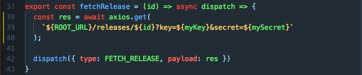
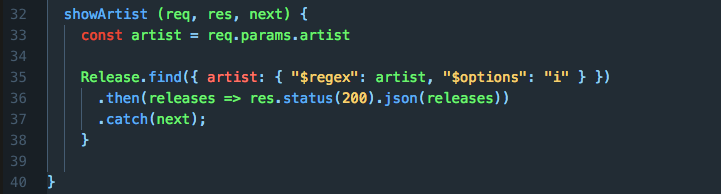

# Discogs Reducer

### (Work in Progress)

Heroku deployment: https://young-escarpment-46778.herokuapp.com/

### Overview

The idea behind this app was to provide a hassle method for listening to music on the popular record listing site Discogs. While the site is unparalleled in its catalogue of released music, recently the interface has become hugely crowded with adverts and links making using it a frustrating experience, especially if the user just wants to listen.

Discogs Reducer removes the noise from the experience, providing the user with an uncluttered interface and nothing but the music and a hypothetical method of purchasing the music. As an addition I've added a streamlined form to add records to the site.

### How it works

Upon landing on the front page of the site the user is presented with an empty page and header containing a link to login. This link takes the user into the Google OAuth flow where they are authenticated, then kicked back to the main music listing page.

The listing page is populated with records stored in a database, in this example each of these are taken from record label I help run when not writing code. There is a drop-down menu at the top of the page containing a list of artists who have released on the label, when any of these is selected the results are filtered to only contain records involving that artist.

When a record is selected - by clicking on the avatar - a GET request is made to the Discogs API using the records ID as a parameter. The response from this request is then used to populate a record detail page with all available videos and a Stripe button labeled with the records lowest price. As it stands this button does nothing beyond load Stripe's test interface, in future it might be used for greater effect.

The final feature is page allowing users to contribute entries of their own to this list. Using redux form the data is then persisted to a form review page before the user confirms, sending a POST request to the database creating a new entry. This entry is then available in the list view.

### Technology used

* Node-Express
* React
* React-Router
* React-Player
* Redux
* Redux-Thunk
* Redux-Form
* Webpack Dev Server
* Passport
* Axios
* Stripe
* Mongoose
* MongoDB

#### Successes

* Using Redux and its connect feature made all data and action creators available directly to each component.

* Use of ternary operators and switch statements to control header content

* Use of Webpack to split dependencies increase performance.

* Use of ES6 syntax throughout makes code both cleaner and easier to read, e.g. using 'async' and 'await' in asynchronous functions.



* The app is extremely fast once loaded. By using React-Router to display components on a single page much of the lag caused in standard multiple page websites was removed.

* Effective use of Passport.js and Google OAuth makes the login process both secure and modern. This could be easily expanded to include login via Facebook, Twitter etc.

* Implementation of middleware on front end to ensure promises are resolved before data was passed to reducers, and on back end to ensure users are validated.

* Learning how to use 'withRouter' properly was a game-changer when it came to combining Redux-Connect and React-Router.

* Use of Mongoose to simplify interactions with MongoDB.



* Materialize library made simple styling easy but effective.

### Evaluation and ideas for improvement

* Stripe implementation needs finishing

* The Redux-Form provides a fast and effective mechanism to enter new releases, though it would be good to also have facility to delete and update items. There are also too many criteria on the form.

* It would be nice to have a way of selecting releases beyond just the one label. Many design choices were influenced by the way in which Discogs API works. By moving all data to the local database there would be more room for manoeuvre, though this may be at odds with the purpose of the app.

* I made the fatal mistake of leaving the setup of React testing until too late in the project: by the time I attempted to install a test suite I'd used in a previous project the sheer number of version conflicts meant I spent an entire day on not getting it to work and simply ran out of time.

* It's very much my intention to rectify this in future, for a more convincing example of React testing see [this project exploring ways of testing React and Redux](https://github.com/joecowton/react-tdd).

* The Stripe payment method would benefit from being launched from some kind of shopping basket page. At this point though the focus would shift from a listening app into an e-commerce site which maybe isn't the point.

#### To run

```
$ git clone https://github.com/joecowton/discogs-db
$ cd discogs-db
$ npm install
$ cd client
$ npm install
$ cd ..
$ npm run dev
```

#### To test

```
$ npm test
```

##### Video walk-through / list page (click to play)

[](https://youtu.be/PzY-jtUyrPc)

##### Record view page


##### Form page


##### Form confirmation page


